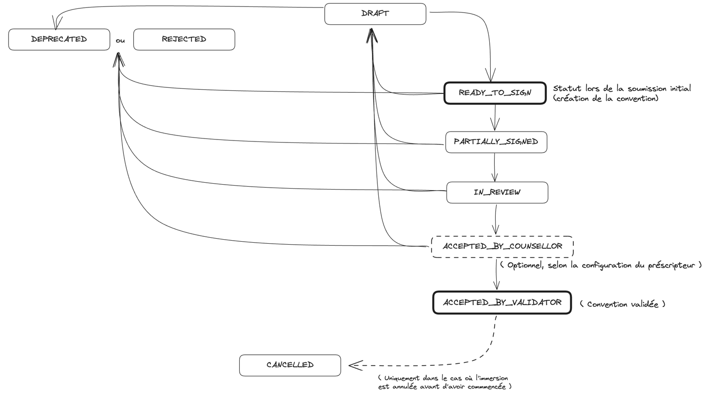

# Immersion Facile

Le but du projet immersion facile est de faciliter les immersions professionnelles.
Il y a pour cela plusieurs axes de travail :

- Dématérialiser entièrement les demandes d'immersion et les interactions des conseillers pôle emploi, missions locales, etc.
- Constituer un annuaire des entreprises qui sont susceptible d'accueillir en immersion
- Rendre les immersions recherchables par les bénéficiaires

### Prérequis

Pour démarrer le projet il vous faut `git`, `docker` et `node` (version 18 ) installée sur la machine.
Nous utilisons `pnpm` comme gestionnaire de paquets (pour l'installer : `npm install -g pnpm`).

### Démarrer le projet

- Demander à être ajouté comme contributeur au projet `gip-inclusion/immersion-facile`
- Cloner le projet

#### Cloner le projet

```sh
git clone ssh://git@github.com:gip-inclusion/immersion-facile.git immersion-facile
cd immersion-facile
```

#### Aperçu du projet

Le projet Immersion Facilitée est un monorepo composé des projets suivants :

- back/ : le back-end de l'application
- front/ : le front-end de l'application
- shared/ : les éléments partagés (types, schemas, utilitaires, etc)
- libs/ :
  - react-design-system : les composants d'interfaces spécifiques Immersion Facilitée (hors DSFR)
  - html-templates : lib maison de génération de contenus HTML (pour les emails par ex)
  - scss-mapper : un générateur de fichier TS à partir de fichier Sass (\*.scss)

#### Installer les dépendances nodes

Chaque projet (front, back) du repo décrit ses dépendances, mais elles sont managées globalement via PNPM.

Pour installer les dépendances nécessaires à tous les projets :

```shell
pnpm install
```

#### Faire une copie du `.env.sample` qui devra s'appeler `.env`:

```sh
cp .env.sample .env
cp .env.sample back/.env
```

#### Jouer le script pour créer les variables d'env du front :

```sh
pnpm generate-front-envfile
```

Le `.env` permet de configurer le mode de fonctionnement de l'application.

On peut lancer avec une base de données postgres simplement en mettant `REPOSITORIES="PG"`.

On peut démarrer facilement une DB local avec docker-compose :

```sh
docker-compose -f docker-compose.resources.yml up --build
```

Il y aura alors une DB postgres accessible sur le port 5432, et un adminer sur le port 8080.

La DATABASE_URL étant fourni, cela devrait fonctionner sans autre configuration.

Les autres services ont une implémentation IN_MEMORY mais pour fonctionner avec les véritables services il faut fournir les secrets /clés API.
Ce n'est pas censé être nécessaire en local, si jamais c'était le cas, veuillez vous rapprocher de l'équipe.

#### Lancer le projet avec docker-compose

On peut démarrer le front et le back en même temps (en mode dev) avec la commande (depuis la racine du projet) :

```shell
pnpm dev
```

Pour le backend se référer ensuite ici:
[Documentation backend](./back/README.md)

Pour le frontend se référer ensuite ici:
[Documentation frontend](./front/README.md)

### Outillage

#### Playwright

Voir [Documentation frontend - Playwright](./front/README.md#e2e-tests-with-playwright)

#### CLI

##### Husky

Husky sert à automatiser des executions de commandes projet avant les commits et les push (format, lint, test...).
En amont des commandes de commit et de push, des tests sont effectués pour vérifier que le commit ou le push peut être effectué (ex: typecheck)

La configuration husky est présente ici [.husky](.husky)  
Documentation locale [.husky.md](.husky/husky.md)  
[Documentation officielle](https://typicode.github.io/husky/#/)

##### Lint-staged

Lint stage permet de ne jouer le lint et le prettier que sur les fichiers qui ont été stage dans Git
La configuration lint-stage est présente ici [.tooling/.lint-staged/.lintstagedrc](.tooling/.lint-staged/.lintstagedrc)
[Documentation officielle](https://github.com/okonet/lint-staged)

##### Sass to TS

Voir [Documentation frontend - Sass to TS](./front/README.md#sass-to-ts)

#### Turbo

TODO DOC

### Métier

Le projet a deux grandes parties :

- les conventions dématérialisées
- les ajouts d'entreprises ainsi que les recherches associées

## Convention dématérialisée

Le flux des statuts de convention est le suivant :


